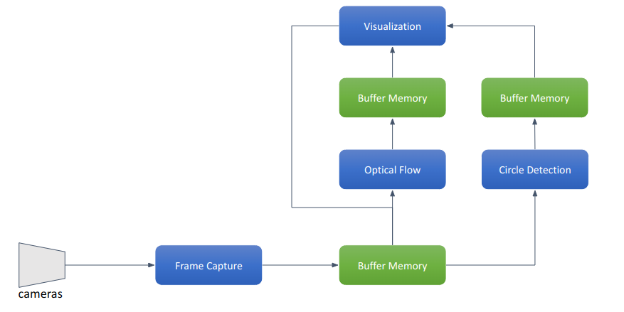

# CameraSerivce
Develop a multi-process application in C++ that captures video frames from a stream, processes them in parallel through different algorithms, and then aggregates the results in a central process for output.

## Dependencies
* [OpenCV](https://github.com/opencv/opencv) - can be installed with package manager
* [CMake](https://cmake.org/download/)
* [Boost.Interprocess](https://www.boost.org/doc/libs/1_78_0/doc/html/interprocess.html)

## Building the CameraSerivce
Follow the steps below to build the project:
* Clone the repository and go to the newly created directory:
  ```bash
  git clone https://github.com/summerjch/CameraSerivce.git
  cd CameraSerivce/
  ```
* Build the project:
  ```bash
  mkdir -p build
  cd build
  cmake ..
  make
  ```
## Running the CameraSerivce
There are four processes so you have to run them in certain order.

First run `frame_capture` process which capture frames from the webcam and produce the frames to the other processes for further processing using shared memory.
```bash
./frame_capture
```
Then run `circle_detection` or `optical_flow` process which consumes the frame from `frame_capture` and processing it with its own image processing algorithm.
```bash
./circle_detection
./optical_flow
```
Finally run `frame_reader` process to visualize the original frame along with the processed frames.
```bash
./frame_reader
```
## Design Thoughts
The whole system has 4 processes runing in parallel. One producer which captures and sends the image frame to other consumers which do the image processing or visualization. Since image frame is large buffer, shared memory is selected as IPC mechanism for fastest transfer.

The whole application is built based on `OpenCV` and `Boost.Interprocess`, since `OpenCV` could provide most functionalities like video capture, image processing and visualization. In the meanwhile `Boost.Interprocess` offers offers a wide range of IPC and synchronization mechanisms.

Most of the work is trying to fullfil the requirement "Make sure the frames are synchronized such that both of the processed frames are displayed with the original frame they were processed from."



Fist define the share memory layout which used for frame buffer transfer and processes synchronization.
```cpp
struct BufferMemory {
  boost::interprocess::interprocess_mutex mutex;
  boost::interprocess::interprocess_condition frame_ready;
  boost::interprocess::interprocess_condition frame_done;
  std::atomic<int> clients_read;
  std::atomic<bool> new_frames[kNumOfClients];
  char frame_data[kFrameWidth * kFrameHeight * kNumOfChannels];
};
```
### Detailed Flow
**Producer(frame_capture)**
1. Frame Capture:
    * The producer captures a new frame from the camera.
    * It locks the mutex and copies the captured frame into the shared memory buffer.
2. Notification:
    * The producer sets all items in `new_frames[kNumOfClients]` to true, resets `clients_read` to 0, and notifies all clients via `frame_ready` that a new frame is available.
3. Waiting for Clients:
    * The producer waits on `frame_done` until `clients_read` equals `kNumOfClients`, indicating that all clients have read the current frame.
    * Once all clients have read the frame, the producer sets all items in `new_frames[kNumOfClients]` to false and proceeds to capture the next frame.

**Clients**
1. Waiting for New Frame:
    * Each client waits on its own `new_frames[client_id]` for notification from the producer about the availability of a new frame.
2. Frame Reading and Processing:
    * Once notified, each client locks the mutex, reads the frame from the shared memory buffer and process/displays it.
    * After processing the frame, the client increments `clients_read` and set its own `new_frames[client_id]` to false.
3. Notification:
    * If `clients_read` equals `kNumOfClients` (indicating that all clients have processed the frame), the last client to process the frame notifies the producer via `frame_done`.

### Need Improvement (a lot ...)
1. Use GPU instead of CPU for image processing.
2. A central process to control all other processes (launch and terminate).
3. A better IPC library or middleware than boost, like ROS, DDS ... 
4. Better visualization using OpenGL, that needs image processing on GPU as well.
5. ....
